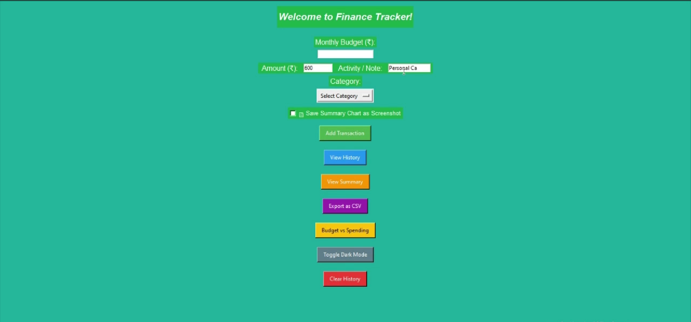
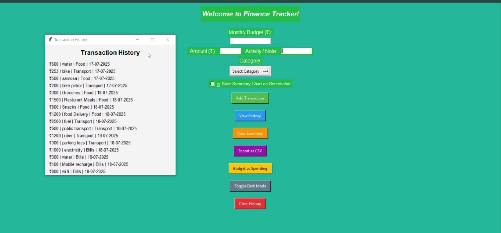
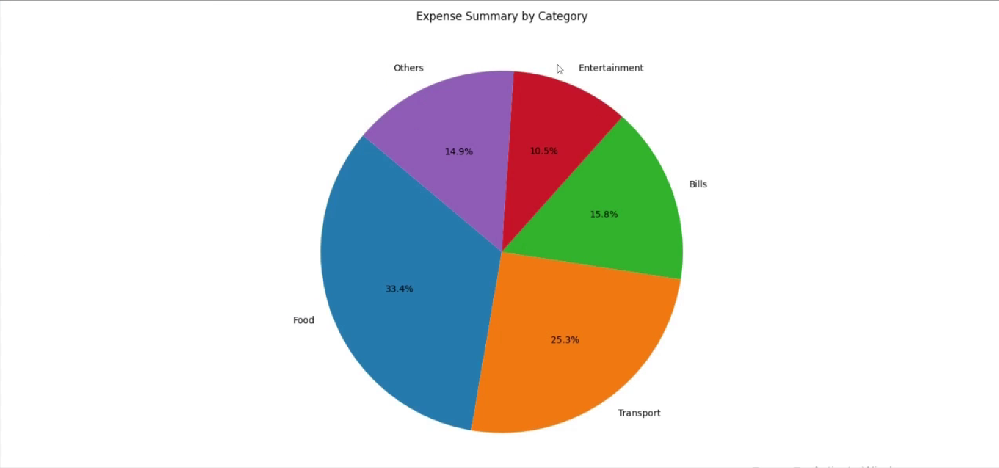
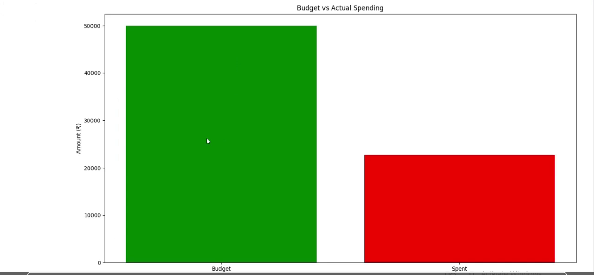

# 💰 Personal Finance Tracker App using Python

This is a simple **Personal Finance Tracker** built with Python.  
It helps users manage their **income**, categorize **expenses**, track **savings goals**, and visualize their **monthly spending patterns**.

---

## 📸 Screenshots

### 🏠 Main Interface


### 📋 Transaction History


### 📊 Expense Pie Chart


### 💡 Budget vs Spending


---

## ⚙️ Features

- Add income and expenses
- Categorize transactions (Food, Rent, Utilities, etc.)
- Track total savings and budgets
- View pie charts for visual insights
- Simple and clean console interface

---

## 🛠️ Getting Started

### 1. Clone the Repository

```bash
git clone https://github.com/mursleenmohd/Personal-Finance-Tracker-App-using-Python.git
cd Personal-Finance-Tracker-App-using-Python

